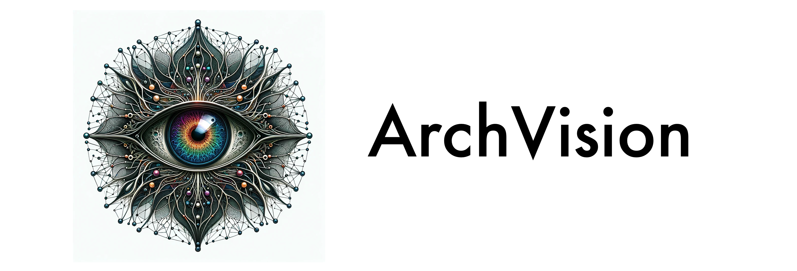

<p align="center">  </p> <p align="center"> <a href="https://docs.python.org/3/whatsnew/3.11.html">  </a> <a href="https://www.pytorch.com/">  </a> <a href="https://opensource.org/license/mit/">  </a> </p>


## Introduction
How far can you model biological vision solely with architecture and local learning? Here we provide code that performs neural architecture search, and local learning to optimize the brain similarity score of deep neural network models of vision.

## Installation
1. **Clone the Repository and Install Dependencies**: 
   - Ensure Poetry is installed on your system. If not, install it from [Poetry's website](https://python-poetry.org/docs/#installation). 
   - In the arch-vision directory, install project dependencies via Poetry:
     ```bash
     git clone git@github.com:yashsmehta/archvision.git
     cd archvision
     poetry install
     ```

3. **Activate the Project Environment**:
   - Activate the Poetry-managed virtual environment:
     ```bash
     poetry shell
     ```


