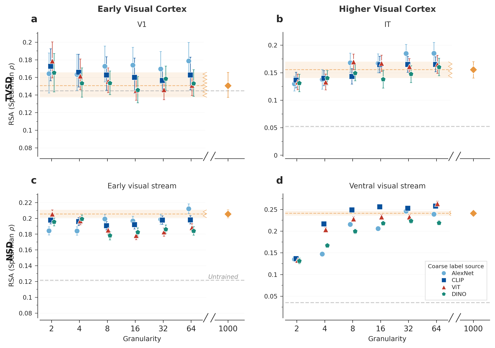
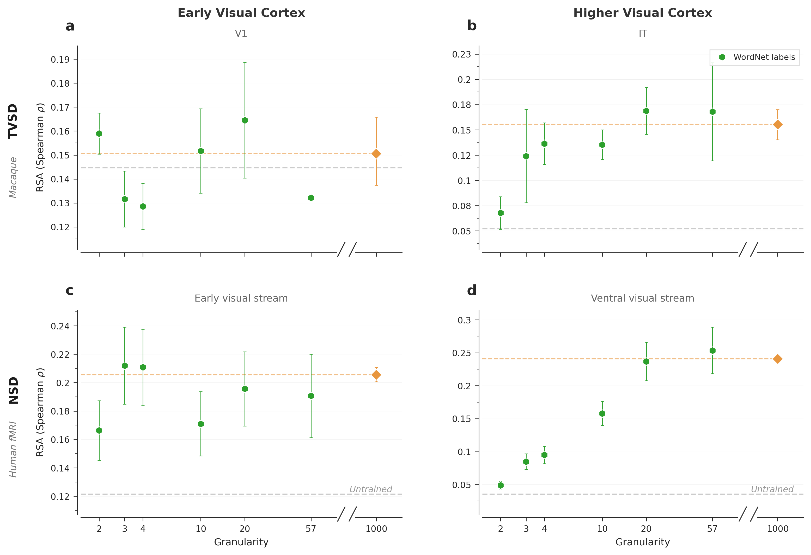
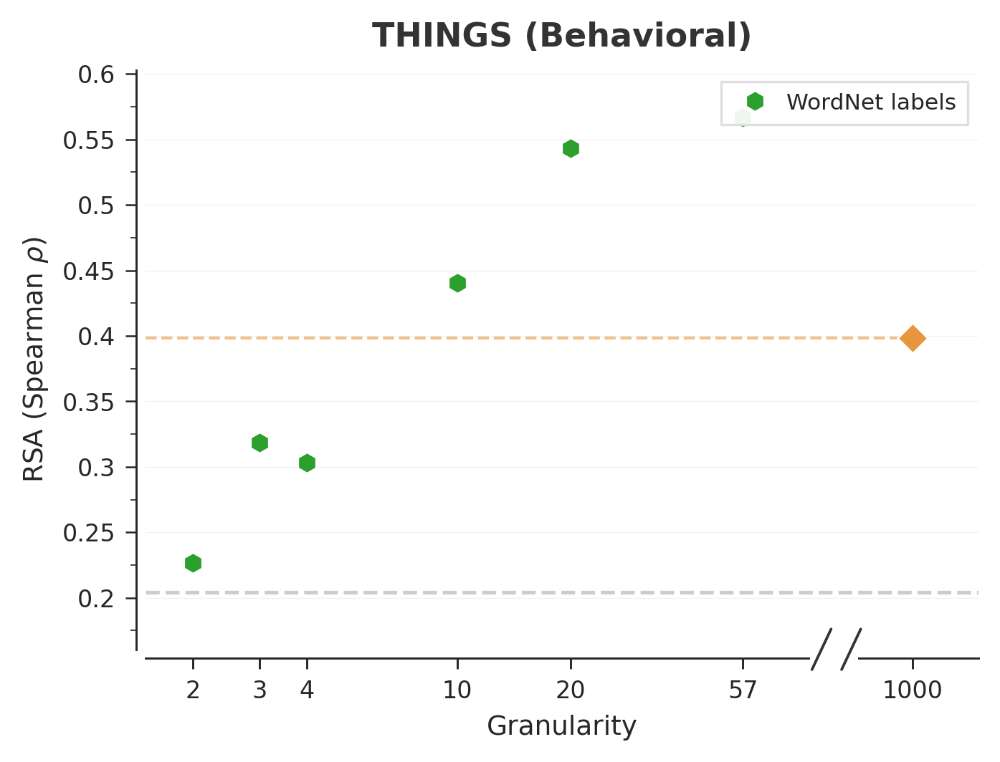
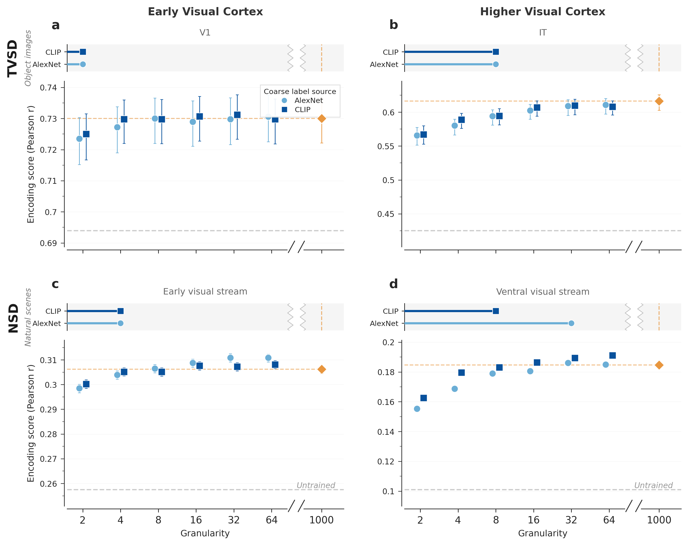
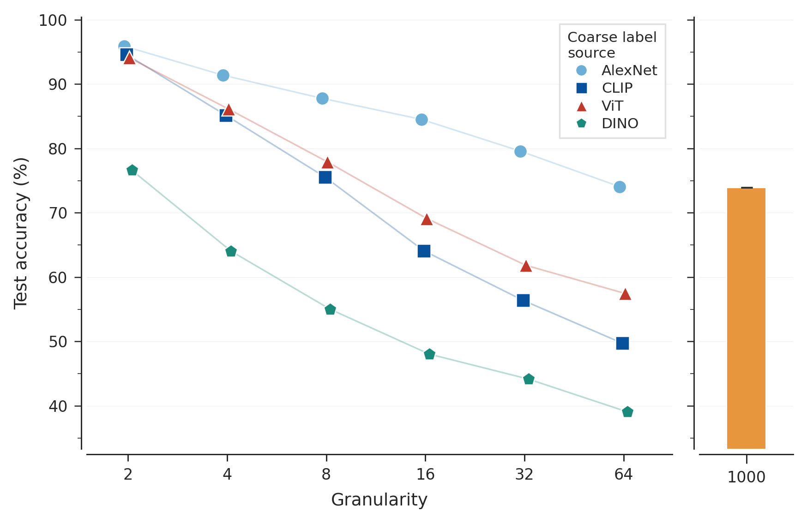
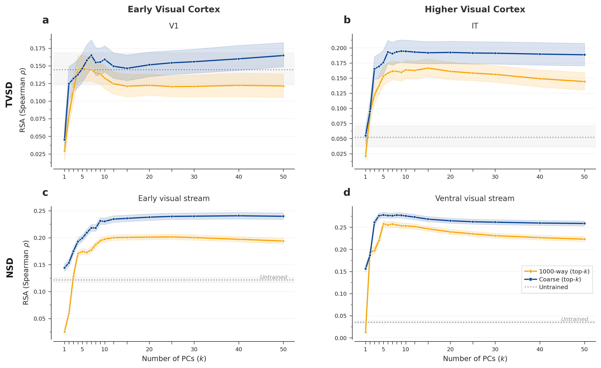
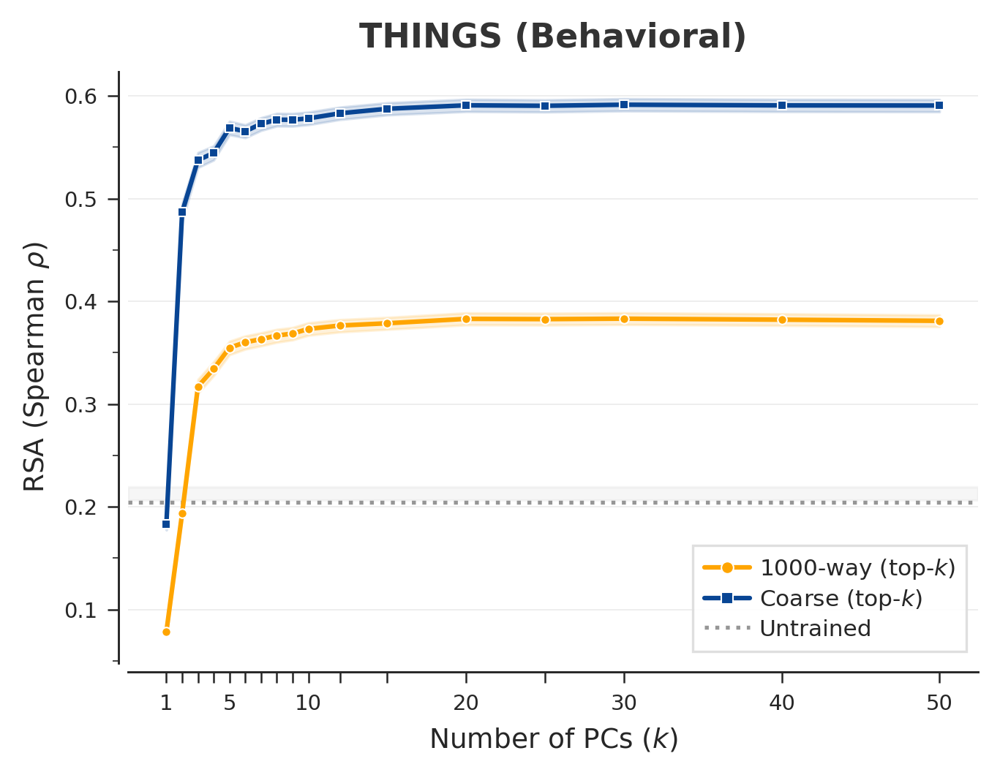

# Extended Data

**Carving Nature at Its Joints: A Coarse Feedback Signal for Learning Human-Aligned Visual Representations**

Extended Data consists of peer-reviewed figures referenced from the main text. Each figure is a standalone panel (or pair of panels) with a self-contained caption; there is no narrative accompanying text — narrative discussion lives in the Supplementary Information (`manuscript/supplementary_information.md`).

---

## Extended Data Fig. 1 | The coarseness–alignment relationship replicates across all PCA label sources.




**Extended Data Fig. 1 | The coarseness–alignment relationship replicates across all PCA label sources.**
Same format as main Fig. 3 (raw Spearman $\rho$, broken x-axis, jittered markers). Four PCA label sources are overlaid per panel: AlexNet (light blue circles), CLIP (dark blue squares), ViT-L/16 (crimson triangles), and DINOv3 (teal pentagons). The 1,000-class baseline is shown as an orange diamond; the untrained-network baseline as a grey dashed line.
**a**, Neural alignment. 2 × 2 grid: TVSD (top row) and NSD (bottom row), for early visual cortex (V1 / early visual stream, left) and higher visual cortex (IT / ventral visual stream, right). Early visual regions are flat across granularity levels for all four sources; higher visual regions show a gradual increase, with all sources converging near or above the 1,000-class baseline by 32–64 classes.
**b**, THINGS behavioural alignment. All four label sources produce coarse models that substantially exceed the 1,000-class baseline, with CLIP-derived labels yielding the highest absolute scores and AlexNet-derived labels the lowest, but no qualitative difference in the shape of the curve.
Error bars denote 95% bootstrap CIs aggregated across subjects (or monkeys) and three independently trained networks per condition. Full per-panel captions in `S1_coarsegrain_models/S1a_description.md` and `S1b_description.md`.

---

## Extended Data Fig. 2 | WordNet-derived coarse labels reproduce the same alignment patterns as PCA-based labels.




**Extended Data Fig. 2 | WordNet-derived coarse labels reproduce the same alignment patterns as PCA-based labels.**
Same format as Extended Data Fig. 1 (broken x-axis, jittered markers). WordNet coarseness levels (2, 3, 4, 10, 20, 57 classes, derived from Wu–Palmer similarity-based hierarchical clustering of the ImageNet noun hierarchy) are shown as forest green hexagons. The 1,000-class baseline is shown as an orange diamond.
**a**, Neural alignment. 2 × 2 grid: TVSD (top) and NSD (bottom) for early visual cortex (left) and higher visual cortex (right). The qualitative pattern — flat early visual profiles, increasing alignment in higher cortex — replicates with this entirely independent, non-PCA label source.
**b**, THINGS behavioural alignment. WordNet-derived coarse models match or exceed the 1,000-class baseline, confirming that the coarseness advantage is not an artifact of the PCA-based label generation procedure.
Error bars denote 95% bootstrap CIs. Full per-panel captions in `S2_wordnet/S2a_description.md` and `S2b_description.md`.

---

## Extended Data Fig. 3 | Encoding-model analysis replicates the neural alignment results from main Fig. 3.



**Extended Data Fig. 3 | Neural alignment measured by encoding score (voxelwise ridge regression).**
Same 2 × 2 layout as main Fig. 3's neural panels: TVSD (top) and NSD (bottom), for early visual cortex (V1 / early visual stream, left) and higher visual cortex (IT / ventral visual stream, right). Alignment is quantified as the held-out Pearson correlation between `RidgeCV`-predicted and measured neural responses (SRP-projected model activations, 5-fold CV for layer selection, refit on the full training set; see Methods). Two PCA label sources are overlaid per panel: AlexNet (light blue circles) and CLIP (dark blue squares); the 1,000-class baseline is shown as an orange diamond. Pixel-derived labels are omitted because no pixel-baseline encoding-score runs are present in `results.db`.
The qualitative pattern mirrors the RSA results in main Fig. 3: early visual regions are flat across granularity levels, while higher visual regions show a gradual increase that converges near or above the 1,000-class baseline by 32–64 classes. The consistency across these two alignment metrics — one geometry-based, one predictive — indicates that the coarseness advantage reflects a genuine representational property rather than an artifact of a single evaluation procedure.
Error bars denote 95% bootstrap CIs aggregated across subjects (or monkeys) and three independently trained networks per condition. Full caption in `S3_encoding_scores/S3_description.md`.

---

## Extended Data Fig. 4 | All models successfully converge, and classification accuracy does not predict alignment quality.



**Extended Data Fig. 4 | Training convergence and classification accuracy across all conditions.**
Final test accuracy (epoch 20, mean ± SEM across 3 seeds) for all four PCA label sources: AlexNet (light blue circles), CLIP (dark blue squares), ViT-L/16 (crimson triangles), and DINOv3 (teal pentagons). Same format as Extended Data Fig. 1 (broken x-axis, jittered markers). The 1,000-class baseline (orange bar, right) is shared across all sources.
Accuracy decreases monotonically with the number of classes. AlexNet-derived labels produce the easiest classification tasks (~96% at 2-way, ~74% at 64-way), while DINOv3-derived labels produce the hardest (~78% at 2-way, ~40% at 64-way). Despite these large accuracy differences, all four sources produce comparable brain and behavioural alignment (Extended Data Fig. 1). This dissociation confirms that classification accuracy is not the driver of alignment quality — the *granularity* of the training objective, not task performance, determines representational alignment with biological vision. Full caption in `S4_training_accuracy/S4_description.md`.

---

## Extended Data Fig. 5 | The principal components used for coarse-graining capture interpretable visual–semantic axes.


**Extended Data Fig. 5 | PCA pole images reveal interpretable structure in the coarse-graining axes.**
For each of two PCA source models — AlexNet (left) and CLIP ViT-L/14 (right) — the 5 most-activating and 5 least-activating ImageNet images are shown along PC1 through PC6, with variance explained (%) annotated for each component. These PCs define the binary splits used to generate coarse labels: PC1 produces the 2-class partition, PCs 1–2 produce the 4-class partition, and so on.
For AlexNet, PC1 separates broadly achromatic, manufactured objects from colourful natural scenes — a largely low-level visual distinction. For CLIP, the axes are more semantically structured: PC1 cleanly separates animals and natural scenes from artifacts and text. Later PCs capture progressively finer distinctions in both models.
Despite these substantial differences in what the axes encode, models trained on labels from both sources achieve comparable brain alignment (Extended Data Fig. 1), indicating that the *granularity* of supervision matters more than the specific axes along which categories are defined. All images are drawn from the ImageNet training set. Full caption in `S5_pc_poles/S5_description.md`.

---

## Extended Data Fig. 6 | Reconstruction control confirms that alignment is not a dimensionality artifact.




**Extended Data Fig. 6 | Alignment differences persist across the full range of representational dimensions.**
Alignment (Spearman $\rho$) as a function of the number of principal components retained ($k = 1, 2, \ldots, 50$) for the best coarse model (blue) and the 1,000-class baseline (orange). The untrained baseline is shown as a grey dotted line; shaded bands indicate 95% CIs. The best coarse model is selected per benchmark: 64-way AlexNet (TVSD V1, TVSD IT, NSD early visual stream), 16-way CLIP (NSD ventral visual stream), 64-way ViT-L/16 (THINGS).
**a**, Neural alignment. 2 × 2 grid: TVSD (top) and NSD (bottom) for early visual cortex (left) and higher visual cortex (right).
**b**, THINGS behavioural alignment.
Both curves plateau by $k \approx 10$–20 PCs, and the coarse model's advantage over the 1,000-class baseline is maintained at every dimensionality. This rules out the possibility that the coarse model's superior alignment arises from dimensionality matching — the structural correspondence is genuine and persists as the representational space expands to full rank. Full per-panel captions in `S6_reconstruction/S6a_description.md` and `S6b_description.md`.

---

## Extended Data Fig. 7 | Seed-to-seed variability is negligible relative to between-condition effects.


**Extended Data Fig. 7 | Alignment scores are highly stable across random training seeds.**
Same format as Extended Data Fig. 1 (broken x-axis). Individual seed scores (coloured markers: circle = seed 1, square = seed 2, triangle = seed 3) with dashed mean lines for each CLIP coarse-grained condition (2, 4, 8, 16, 32, 64 classes) and the 1,000-class baseline (orange). The untrained baseline is shown as a grey dashed line.
**a**, Neural alignment. 2 × 2 grid: TVSD (top) and NSD (bottom) for early visual cortex (left) and higher visual cortex (right).
**b**, THINGS behavioural alignment.
Across all conditions and benchmarks, the three seed scores cluster tightly around their mean, with inter-seed variability substantially smaller than the within-seed bootstrap confidence intervals. This confirms that training stochasticity (random initialisation, data shuffling, dropout) does not meaningfully influence the alignment results and that the patterns reported in the main text are reproducible. Full per-panel captions in `S7_seed_variability/S7a_description.md` and `S7b_description.md`.

---

## Code and Data Availability

Each Extended Data figure lives in its own subfolder under `manuscript/figures/extended_data/`, containing the generating script, its output PNG(s), and a Nature-style `*_description.md` file per panel.

| Extended Data Fig. | Folder | Generating script |
|---|---|---|
| Fig. 1 (PCA sources) | `S1_coarsegrain_models/` | `S1_coarsegrain_models.py` |
| Fig. 2 (WordNet) | `S2_wordnet/` | `S2_wordnet.py` |
| Fig. 3 (Encoding scores) | `S3_encoding_scores/` | `S3_encoding_scores.py` |
| Fig. 4 (Training accuracy) | `S4_training_accuracy/` | `S4_training_accuracy.py` |
| Fig. 5 (PCA poles) | `S5_pc_poles/` | `S5_pc_poles.py` |
| Fig. 6 (Reconstruction) | `S6_reconstruction/` | `S6_reconstruction.py` |
| Fig. 7 (Seed variability) | `S7_seed_variability/` | `S7_seed_variability.py` |

```bash
# From project root (visreps/)
source .venv/bin/activate

# DB-only figures (no GPU needed)
python manuscript/figures/extended_data/S1_coarsegrain_models/S1_coarsegrain_models.py
python manuscript/figures/extended_data/S2_wordnet/S2_wordnet.py
python manuscript/figures/extended_data/S3_encoding_scores/S3_encoding_scores.py
python manuscript/figures/extended_data/S4_training_accuracy/S4_training_accuracy.py
python manuscript/figures/extended_data/S6_reconstruction/S6_reconstruction.py
python manuscript/figures/extended_data/S7_seed_variability/S7_seed_variability.py

# Image-loading figure (needs ImageNet access)
python manuscript/figures/extended_data/S5_pc_poles/S5_pc_poles.py
```

| Data source | Location | Used by |
|---|---|---|
| Results database | `results.db` | ED Figs. 1–4, 6, 7 |
| Training metrics | `/data/ymehta3/{alexnet_pca,clip_pca,vit_pca,dino_pca,default}/cfg*/training_metrics.csv` | ED Fig. 4 |
| WordNet labels | `pca_labels_wordnet/` (referenced in `results.db`) | ED Fig. 2 |
| PCA poles | `datasets/obj_cls/imagenet/pca_poles/` | ED Fig. 5 |
| Eigenvalues | `datasets/obj_cls/imagenet/eigenvectors_{alexnet,clip}.npz` | ED Fig. 5 |
| ImageNet images | `IMAGENET_DATA_DIR` (from `.env`) | ED Fig. 5 |
