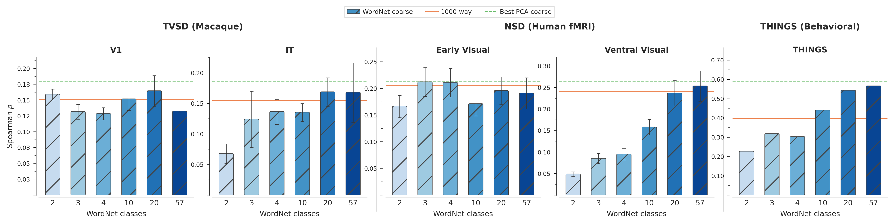
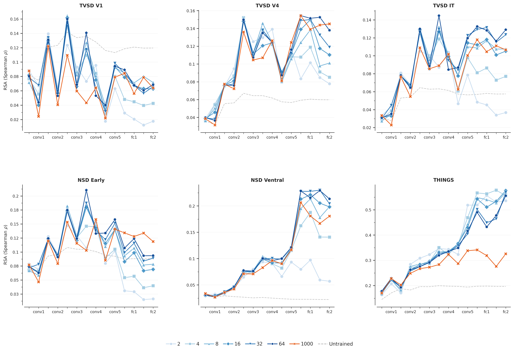
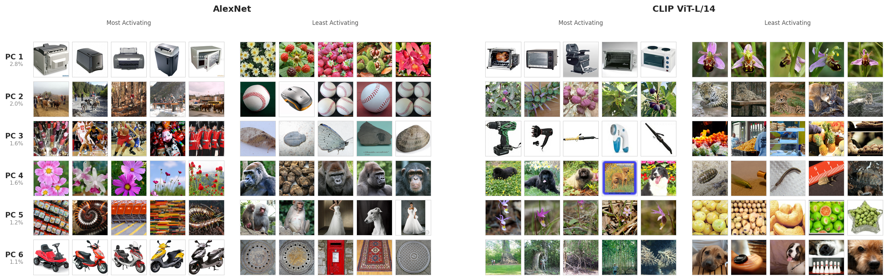
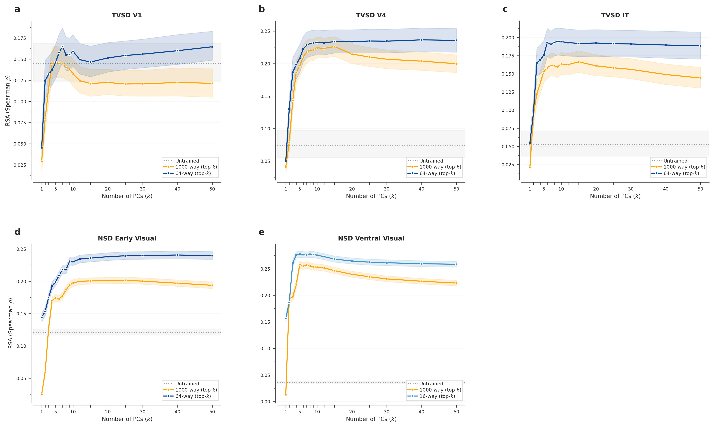
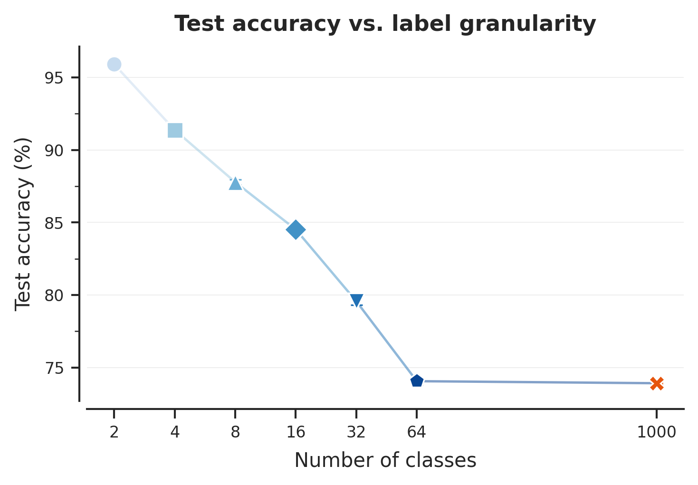
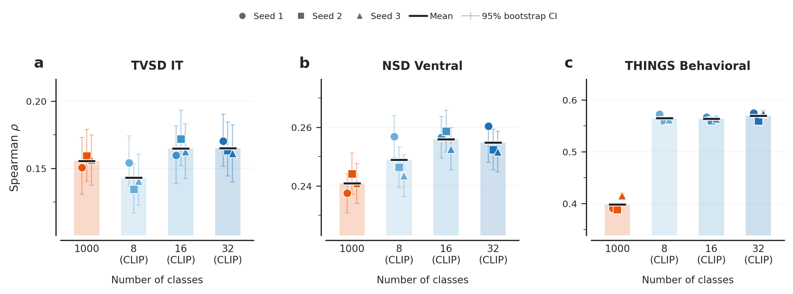

# Supplementary Materials

**Carving Nature at Its Joints: A Coarse Feedback Signal for Learning Human-Aligned Visual Representations**

---

## Overview

This supplement provides additional analyses supporting the main findings. The supplementary figures are organized into four themes: (1) **alternative label sources** (Figures S1--S2), demonstrating that the coarseness--alignment relationship replicates with additional PCA source models and with WordNet-derived labels; (2) **extended neural analyses** (Figures S3--S4), providing full per-layer profiles and fine-grained ROI decomposition; (3) **label space interpretability** (Figures S5--S6), visualizing the PCA axes used for coarse-graining and the PC reconstruction control; and (4) **training and reproducibility controls** (Figures S7--S8), confirming model convergence and quantifying seed-to-seed variability.

All alignment scores use Spearman $\rho$ (RSA) unless otherwise noted. Error bars denote 95% bootstrap CIs (NSD, THINGS) or $\pm$1.96 SEM across monkeys $\times$ seeds (TVSD). Code for all figures is available in `manuscript/figures/supplementary/`.

---

## Figure S1. Alternative PCA source models (ViT and DINOv3)


**Figure S1. The coarseness--alignment relationship replicates with ViT- and DINOv3-derived labels across all benchmarks.** Same visual format as main Figure 3 (raw Spearman $\rho$, broken x-axis). **(A)** Neural alignment across species: coarseness curves for models trained on ViT-Base (crimson triangles) and DINOv3 (ViT-L/16, self-supervised; teal pentagons) labels, shown for TVSD V1 and IT (left column) and NSD early and ventral visual streams (right column). **(B)** Behavioral alignment: THINGS behavioral similarity. Both architectures produce the same qualitative pattern seen with AlexNet and CLIP in the main figures: early visual regions are flat across granularity, higher regions show a gradual increase, and THINGS coarse models exceed the 1000-way baseline (orange diamond). This demonstrates that the main findings are not contingent on the specific representational geometry of any single PCA source model.

---

## Figure S2. WordNet hierarchy as alternative coarse label source



**Figure S2. Models trained on WordNet-derived coarse labels show comparable alignment patterns to PCA-based labels.** WordNet coarseness levels (2, 3, 4, 10, 20, 57 classes derived from Wu--Palmer similarity-based hierarchical clustering) are shown as blue-gradient bars across TVSD V1 (**a**), TVSD IT (**b**), NSD early visual stream (**c**), NSD ventral visual stream (**d**), and THINGS behavioral similarity (**e**). Horizontal reference lines indicate the 1000-way baseline (orange) and the best PCA-coarse model (green dashed). The qualitative pattern -- early visual regions saturate at low granularity, higher regions show gradual increases -- replicates with this entirely independent label source, confirming that the coarseness--alignment relationship is not an artifact of the PCA-based label generation procedure.

---

## Figure S3. Full per-layer profiles for all 7 granularity levels



**Figure S3. Per-layer RSA profiles across all seven granularity levels reveal layer-dependent effects of label coarseness.** Complete per-layer profiles for all granularity levels: 2, 4, 8, 16, 32, 64-way (blue gradient, light to dark), 1000-way (orange), and untrained (gray dashed). Panels cover TVSD V1 (**a**), TVSD V4 (**b**), TVSD IT (**c**), NSD early visual stream (**d**), NSD ventral visual stream (**e**), and THINGS (**f**). The best PCA source architecture is auto-selected per region. Key patterns: (1) in early visual regions (TVSD V1, NSD Early), per-layer profiles overlap across granularity levels, confirming the flat coarseness curve from a complementary perspective; (2) in higher visual regions (TVSD IT, NSD Ventral), profiles fan out in later layers, with coarser models peaking at intermediate layers and finer models at deeper layers; (3) for THINGS, coarse models consistently achieve higher peak RSA than 1000-way across the full layer hierarchy.

---

## Figure S4. Fine-grained ROI decomposition (NSD)


**Figure S4. Coarseness effects at finer anatomical resolution across six individual ROIs.** Normalized coarseness curves for V1 (**a**), V2 (**b**), V3 (**c**), hV4 (**d**), FFA (**e**), and PPA (**f**), all from NSD. Four PCA source architectures are plotted (AlexNet, CLIP, ViT, Pixels). Main Figure 3 collapses these into two broad streams (early = V1+V2+V3; ventral = hV4+higher areas); this figure reveals the pattern at the level of individual retinotopic and category-selective regions. Early visual areas (V1--V3) show the characteristic flat profile: even 2-class models achieve $\sim$90--100% of 1000-way alignment. The most pronounced granularity dependence appears in category-selective cortex: FFA shows a steep ramp from $\sim$50% to $\sim$100%, and PPA from $\sim$65% to $\sim$100%, consistent with these regions' known selectivity for fine-grained object categories. Notably, even for FFA and PPA, 32-class models approach the 1000-way ceiling.

---

## Figure S5. Top principal component pole images for each PCA source model



**Figure S5. The principal components used for coarse-graining capture interpretable visual and semantic axes.** For each of two PCA source models -- AlexNet (left) and CLIP ViT-L/14 (right) -- we show the 5 most-activating and 5 least-activating ImageNet images along PC1 through PC6, with variance explained (%) for each component. These PCs define the binary splits used to generate coarse labels: PC1 produces the 2-class partition, PCs 1--2 produce the 4-class partition, and so on. For AlexNet, PC1 separates broadly gray/man-made objects from colorful natural scenes. For CLIP, the axes are more semantically structured: PC1 separates animals/nature from artifacts/text. Despite these differences, models trained on labels from both sources achieve comparable brain alignment, suggesting that the *granularity* of supervision matters more than the specific axes along which categories are defined.

---

## Figure S6. Reconstruction control: alignment vs. number of PCs retained



**Figure S6. Reconstruction control confirms that alignment is not an artifact of dimensionality reduction.** Alignment (Spearman $\rho$) as a function of the number of PCs retained (top-$k$) for the best coarse model (blue) vs. 1000-way (orange) across all neural dataset--region pairs: TVSD V1 (**a**), TVSD V4 (**b**), TVSD IT (**c**), NSD early visual stream (**d**), and NSD ventral visual stream (**e**). The untrained baseline is shown as a gray dashed line; shaded bands indicate 95% CIs. Both curves plateau by $k \approx 10$--20 PCs, indicating that the representational structure captured by a small number of principal dimensions is sufficient for alignment. These reconstruction curves demonstrate that the main alignment results are robust to the number of representational dimensions considered.

---

## Figure S7. Training convergence and classification accuracy



**Figure S7. All models successfully learn their respective classification tasks, with accuracy monotonically decreasing as granularity increases.** Final test accuracy (epoch 20, mean $\pm$ SEM across 3 seeds) is plotted as a function of the number of output classes on a log$_2$ scale. Models trained on AlexNet-PCA labels are shown (representative across PCA source models). Two-class models achieve $\sim$96% accuracy, while 1000-way models reach $\sim$74% -- consistent with AlexNet-class architectures trained for 20 epochs. The monotonic decrease confirms that all coarse models converge and that differences in brain-model alignment (Figures 3--4) are not attributable to training failure. Error bars are smaller than markers, indicating high reproducibility across seeds.

---

## Figure S8. Seed variability across benchmarks



**Figure S8. Alignment scores are highly stable across random training seeds.** Individual seed scores (colored markers: circle = seed 1, square = seed 2, triangle = seed 3) with 95% bootstrap CIs (error bars) for the 1000-class baseline and three CLIP coarse-grained models (8, 16, 32 classes) across three benchmarks: macaque IT electrophysiology (**a**), human ventral visual stream fMRI (**b**), and THINGS behavioral similarity (**c**). Black horizontal lines indicate the cross-seed mean. Across all conditions and benchmarks, seed-to-seed variability is substantially smaller than within-seed bootstrap uncertainty, confirming that training stochasticity is not a dominant source of variance in the alignment results.

---

## Running All Figures

```bash
# From project root (visreps/)
source .venv/bin/activate

# DB-only figures (no GPU needed)
python manuscript/figures/supplementary/supp_s1_alternative_pca.py
python manuscript/figures/supplementary/supp_s2_wordnet.py
python manuscript/figures/supplementary/supp_s3_full_per_layer.py
python manuscript/figures/supplementary/supp_s4_finegrained_roi.py
python manuscript/figures/supplementary/supp_s6_reconstruction.py
python manuscript/figures/supplementary/supp_s7_training_summary.py
python manuscript/figures/supplementary/supp_s8_seed_variability.py

# Image-loading figure (needs ImageNet access)
python manuscript/figures/supplementary/supp_s5_pc_poles.py
```

## Data Sources

| Source | Location | Used By |
|--------|----------|---------|
| Results DB | `results.db` | S1--S4, S6, S8 |
| Training metrics | `/data/ymehta3/{alexnet_pca,default}/cfg*/training_metrics.csv` | S7 |
| PCA poles | `datasets/obj_cls/imagenet/pca_poles/` | S5 |
| Eigenvalues | `datasets/obj_cls/imagenet/eigenvectors_{alexnet,clip}.npz` | S5 |
| ImageNet images | `IMAGENET_DATA_DIR` (from `.env`) | S5 |
