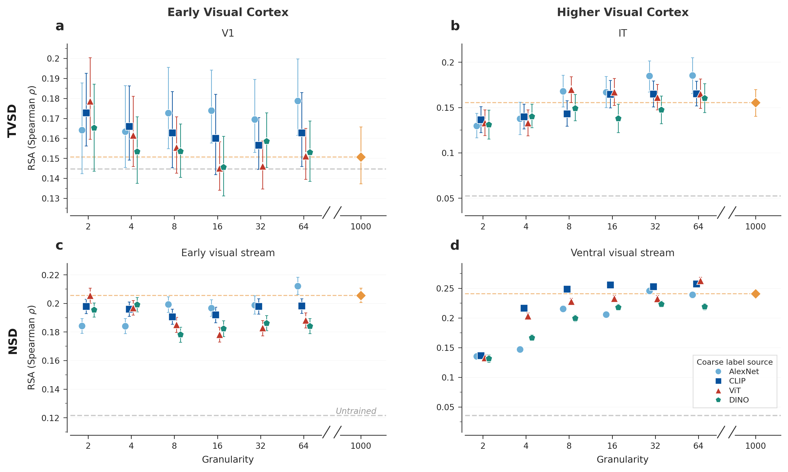
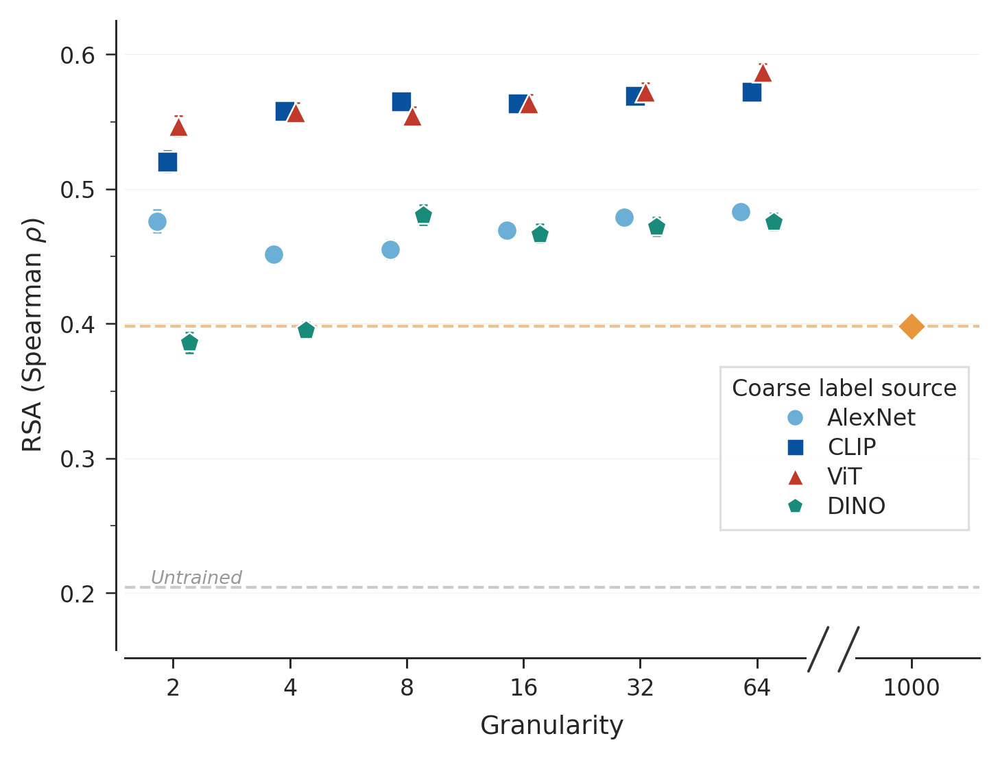
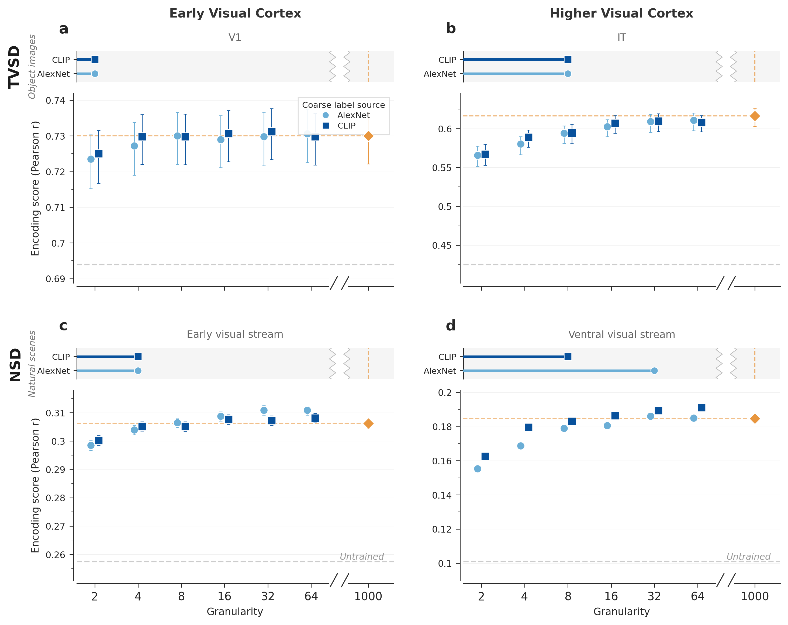
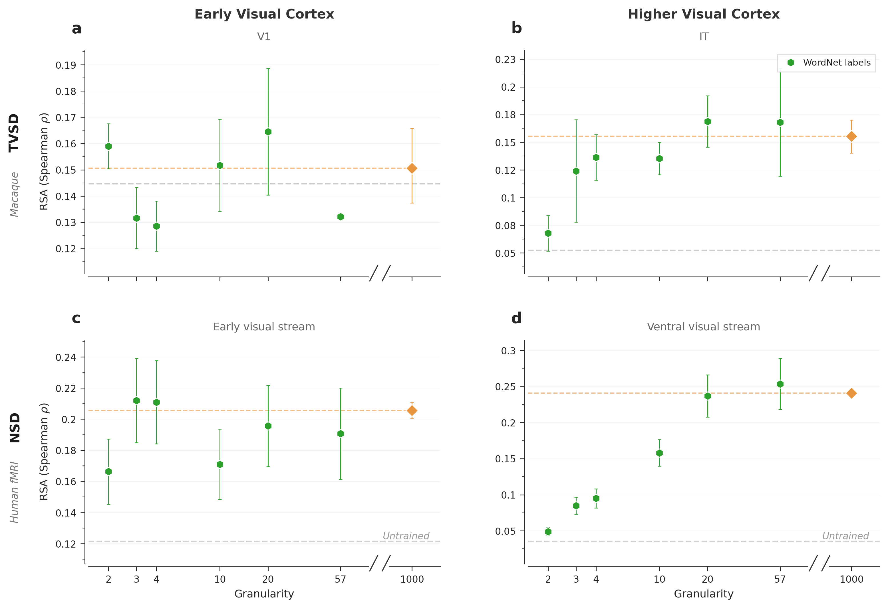
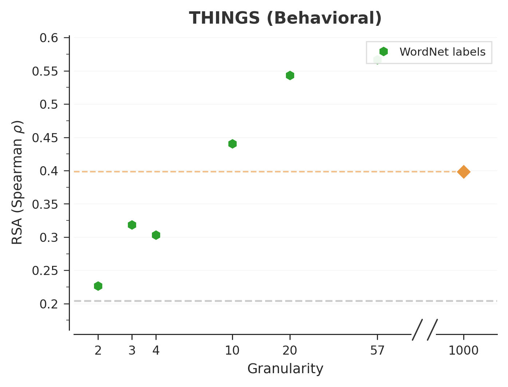
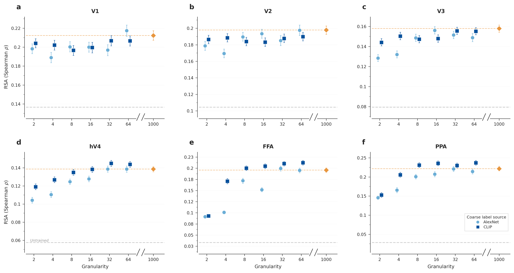
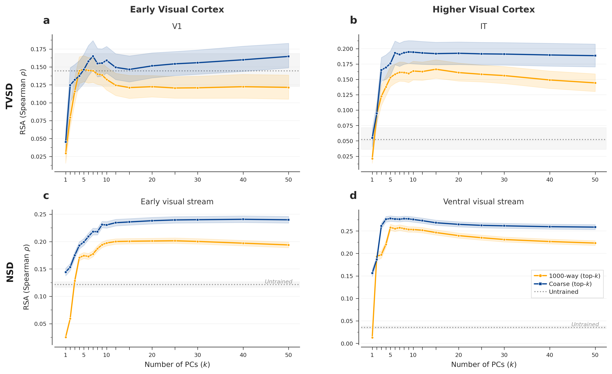
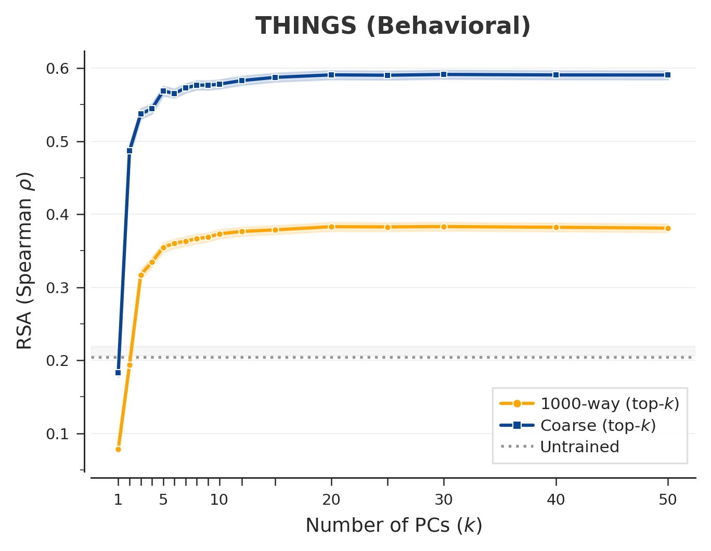
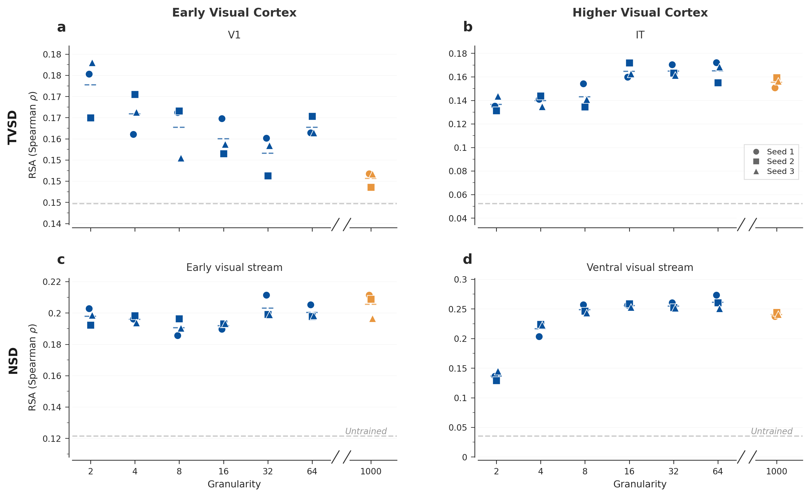
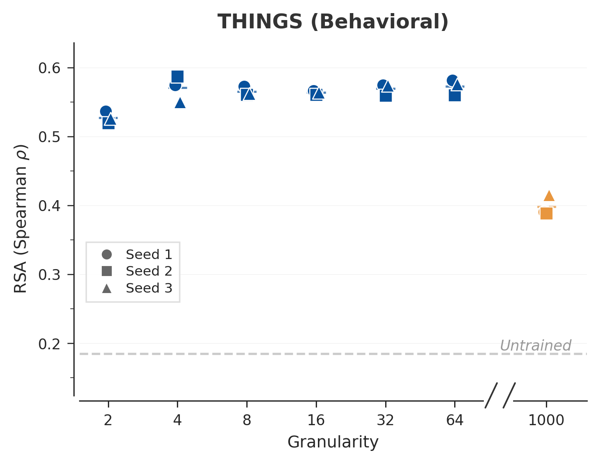

# Supplementary Information

**Carving Nature at Its Joints: A Coarse Feedback Signal for Learning Human-Aligned Visual Representations**

---

## Supplementary Text

### Supplementary Note 1. The coarseness–alignment relationship is robust across PCA source models

*Does the alignment advantage of coarse training depend on which pretrained model is used to define the label boundaries?*

Our coarse-graining procedure extracts principal components from a pretrained model's feature space and uses median splits along these axes to generate labels. A critical question is whether the resulting alignment patterns are contingent on the specific source model — its architecture, training objective, or representational geometry. In the main text, we present three label sources (AlexNet, CLIP, and raw pixels) chosen to span a broad range of representational quality. Here, we evaluate two additional source models: a supervised ViT-L/16 (Dosovitskiy et al., 2021) and DINOv3, a self-supervised vision transformer (Oquab et al., 2024). These four models differ substantially — from a CNN trained on ImageNet classification to a transformer trained via self-supervised distillation — yet all are used identically: only their feature-space PCA defines the coarse labels; the downstream networks are always trained from scratch.

The qualitative pattern is identical across all four sources (Supplementary Fig. 1): early visual regions show flat profiles regardless of granularity, higher visual regions exhibit gradual increases, and coarse models match or exceed the 1,000-class baseline for behavioural alignment. This consistency — despite the fact that AlexNet's PC1 captures low-level visual statistics while CLIP's PC1 captures high-level semantics (Supplementary Fig. 6) — demonstrates that what matters is the *granularity* of the partitioning, not the specific axes along which images are divided.

### Supplementary Note 2. Encoding-score analysis replicates the RSA-based neural alignment results

*Is the coarseness–alignment pattern in neural cortex specific to representational similarity analysis, or does it also appear under an encoding-model evaluation?*

Main Figure 3 quantifies neural alignment with representational similarity analysis (RSA), which compares model and brain representational geometries via Spearman correlations between pairwise-distance matrices. RSA is sensitive to the *structure* of a representation but is agnostic to any particular linear mapping between model units and voxels. A complementary evaluation — encoding models — instead fits voxelwise ridge regressions from model activations to measured responses and reports the held-out Pearson correlation between predicted and observed activity. These two metrics emphasise different aspects of alignment, and a finding that depends on only one of them would be difficult to interpret.

We therefore recomputed all neural alignment scores using encoding models (voxelwise `RidgeCV` with SRP-projected activations; see Methods). The qualitative pattern is identical to the RSA results (Supplementary Fig. 2): in both TVSD and NSD, early visual regions show flat coarseness profiles regardless of label granularity, while higher visual regions exhibit the same gradual increase that culminates near or above the 1,000-class baseline. The agreement between RSA and encoding-score evaluations indicates that the coarseness–alignment relationship reflects a genuine property of the learned representations rather than an artifact of any single alignment metric.

### Supplementary Note 3. The coarseness advantage replicates with WordNet-derived labels

*Is the coarseness–alignment relationship specific to PCA-based label generation, or does it reflect a more general property of coarse supervision?*

All label sources in the main text and Supplementary Note 1 share a common construction: principal component analysis on learned visual features. To test whether the alignment patterns we observe are tied to this specific procedure, we generated an entirely independent set of coarse labels using the WordNet noun hierarchy (Miller, 1995). Starting from the 1,000 ImageNet synsets, we computed pairwise Wu–Palmer semantic similarity scores (Wu & Palmer, 1994) and applied hierarchical agglomerative clustering to produce partitions at multiple granularity levels (2, 3, 4, 10, 20, and 57 classes). This procedure uses no learned visual representations whatsoever — it relies solely on the lexical-semantic distances between English nouns.

Models trained on WordNet-derived labels reproduce the same qualitative pattern (Supplementary Fig. 3): flat alignment in early visual cortex, increasing alignment in higher cortex, and behavioural alignment that matches or exceeds the 1,000-class baseline. The convergence across two fundamentally different label generation procedures — one grounded in visual feature statistics, the other in linguistic taxonomy — provides strong evidence that the coarseness–alignment relationship reflects a genuine property of how coarse category boundaries shape learned representations, rather than an artifact of any particular method for constructing those boundaries.

### Supplementary Note 4. Per-layer profiles reveal where in the network coarseness exerts its effect

*Does the coarseness advantage arise at a specific stage of the network's feature hierarchy, or is it distributed across layers?*

The main figures report alignment using the best-performing layer for each model, selected on held-out data. This ensures fair comparison but obscures whether coarseness has a uniform effect across the network's representational hierarchy or acts preferentially at certain stages. To address this, we computed full per-layer RSA profiles for every granularity level (2 through 64 classes, 1,000-way, and untrained) across all benchmarks.

The results reveal a striking dissociation (Supplementary Fig. 4). In early visual regions (TVSD V1, NSD early visual stream), per-layer profiles overlap almost completely across granularity levels — features at every layer are equally well-aligned regardless of whether the model was trained on 2 or 64 classes. This provides an independent confirmation of the flat coarseness curves in the main figures, now from the perspective of individual layers rather than best-layer selection. In higher visual regions (TVSD IT, NSD ventral visual stream) and for behavioural alignment (THINGS), the profiles fan out at deeper layers: coarser models tend to peak at intermediate layers (fc1), while finer-grained models peak at the deepest layers (fc2). For THINGS, coarse models achieve higher peak alignment than the 1,000-way baseline at *every* layer — the advantage pervades the entire feature hierarchy, not just a single representational bottleneck.

### Supplementary Note 5. Fine-grained ROI decomposition reveals a gradient from retinotopic to category-selective cortex

*Is the flat early-visual profile and the increasing ventral-stream profile consistent at finer anatomical resolution, or does the broad-stream aggregation mask region-specific effects?*

The main text reports NSD results for two broad cortical streams: the early visual stream (V1 + V2 + V3) and the ventral visual stream (hV4 + higher areas). This aggregation provides a clean summary but could obscure important regional variation. We therefore decomposed the NSD results into six individual regions of interest spanning the full hierarchy from retinotopic cortex to category-selective areas: V1, V2, V3, hV4, fusiform face area (FFA), and parahippocampal place area (PPA).

The decomposition reveals a graded pattern consistent with the broad-stream summary but richer in detail (Supplementary Fig. 5). V1, V2, and V3 each individually show the characteristic flat profile — alignment is constant across granularity levels, confirming that early visual representations are insensitive to the richness of the training objective at the level of individual retinotopic maps, not just in aggregate. The granularity dependence increases progressively from hV4 — which occupies an intermediate position — to category-selective cortex, where FFA and PPA show the steepest alignment gains with increasing coarseness. This is consistent with these regions' known functional specialisation for object and scene categories, and indicates that the ventral-stream effect reported in the main figures is driven primarily by category-selective cortex rather than intermediate visual areas.

### Supplementary Note 6. The PCA axes used for coarse-graining capture interpretable visual–semantic structure

*What do the coarse categories actually look like? Are the PCA-derived partitions semantically meaningful or arbitrary?*

Supplementary Notes 1 and 3 establish that the coarseness–alignment relationship holds across multiple label sources. A natural follow-up question is what these label axes actually capture. If the resulting categories were arbitrary or degenerate — for instance, if they simply split images by file size or aspect ratio — the alignment results would be difficult to interpret. To provide intuition, we visualise the images at the extremes ("poles") of each PC axis for two representative source models: AlexNet and CLIP.

For AlexNet, PC1 primarily separates achromatic, manufactured objects from colourful natural scenes — a largely low-level visual distinction that nonetheless tracks a meaningful perceptual boundary (Supplementary Fig. 6). For CLIP, the axes are more semantically structured: PC1 cleanly separates animals and natural scenes from artifacts and text. Later PCs (2–6) capture progressively finer distinctions in both models, and the variance explained decreases accordingly. Crucially, despite these substantial differences in what the axes encode, models trained on labels from both sources achieve comparable neural and behavioural alignment (Supplementary Fig. 1). This reinforces the conclusion from Supplementary Notes 1 and 3: the *scale* of the partitioning — how many categories it produces — matters more than the particular semantic content of the boundaries.

### Supplementary Note 7. Alignment is not an artifact of representational dimensionality

*Could coarse training produce low-dimensional representations that align with low-dimensional structure in neural or behavioural data simply by dimensionality matching?*

A potential confound is that coarse-trained models learn representations that are effectively low-dimensional — captured by a handful of principal components — and that these happen to match low-dimensional structure in neural or behavioural data. Under this scenario, the alignment advantage would reflect a dimensionality-matching artifact rather than meaningful representational similarity. To test this, we projected each model's best-layer activations onto the top-$k$ principal components (for $k = 1, 2, \ldots, 50$) and recomputed alignment at each dimensionality.

Alignment for both the best coarse model and the 1,000-class baseline plateaus rapidly, typically by $k \approx 10$–20 PCs (Supplementary Fig. 7). Crucially, the coarse model's advantage over the 1,000-class baseline is maintained across the full range of retained dimensions. The structural correspondence is not confined to the first few PCs; it persists even as the representational space expands to its full rank. This rules out dimensionality matching as an explanation and confirms that the alignment differences reflect genuine representational structure.

### Supplementary Note 8. All models successfully learn their classification tasks, but accuracy does not predict alignment

*Do coarsely trained models actually learn, and could their alignment advantage simply be a byproduct of higher classification accuracy on easier tasks?*

Varying granularity from 2 to 1,000 classes changes not only the supervisory signal but also the difficulty of the classification task. Two opposite concerns arise. First, if coarsely trained models failed to learn — producing near-random features — any alignment with brain data would be uninterpretable. Second, if coarse models' alignment advantage were simply a byproduct of higher classification accuracy on easier tasks, the results would have a trivial explanation.

Neither concern is borne out (Supplementary Fig. 8). All models successfully converge, with final test accuracy monotonically decreasing as the number of classes increases (from ~96% at 2-way to ~30% at 1,000-way for AlexNet-derived labels). More informatively, there are large accuracy differences across PCA source models at matched granularity: AlexNet-derived labels produce the easiest tasks (~74% at 64-way), while DINO-derived labels produce the hardest (~40% at 64-way). Despite these substantial accuracy differences, all four label sources produce comparable brain and behavioural alignment (Supplementary Fig. 1). This double dissociation — accuracy varies with label source while alignment does not — rules out classification accuracy as the driver of alignment quality.

### Supplementary Note 9. Alignment results are reproducible across random training seeds

*Are the reported alignment patterns stable across independent training runs, or could they be driven by fortuitous random initialisation?*

Every condition in this study is trained with three independent random seeds, controlling for stochasticity in weight initialisation, data shuffling, and dropout. To verify that our conclusions are not sensitive to particular seed choices, we visualise all individual seed scores alongside the condition means.

Across all benchmarks and granularity levels, seed-to-seed variability is consistently small — substantially smaller than the within-seed bootstrap confidence intervals and negligible relative to between-condition effects (Supplementary Fig. 9). The three seed scores cluster tightly around their respective means for both coarse-grained conditions and the 1,000-class baseline. This confirms that training stochasticity does not meaningfully influence the alignment results and that the patterns reported in the main text are reproducible.

---

## Supplementary Figures

---

### Supplementary Fig. 1 | The coarseness–alignment relationship replicates across all PCA label sources.




**Supplementary Fig. 1 | The coarseness–alignment relationship replicates across all PCA label sources.**
Same format as main Fig. 3 (raw Spearman $\rho$, broken x-axis, jittered markers). Four PCA label sources are overlaid per panel: AlexNet (light blue circles), CLIP (dark blue squares), ViT-L/16 (crimson triangles), and DINOv3 (teal pentagons). The 1,000-class baseline is shown as an orange diamond; the untrained-network baseline as a grey dashed line.
**a**, Neural alignment. 2 × 2 grid: TVSD (top row) and NSD (bottom row), for early visual cortex (V1 / early visual stream, left) and higher visual cortex (IT / ventral visual stream, right). Early visual regions are flat across granularity levels for all four sources; higher visual regions show a gradual increase, with all sources converging near or above the 1,000-class baseline by 32–64 classes.
**b**, THINGS behavioural alignment. All four label sources produce coarse models that substantially exceed the 1,000-class baseline, with CLIP-derived labels yielding the highest absolute scores and AlexNet-derived labels the lowest, but no qualitative difference in the shape of the curve.
Error bars denote 95% bootstrap CIs aggregated across subjects (or monkeys) and three independently trained networks per condition. Full per-panel captions are provided in `S1_coarsegrain_models/S1a_description.md` and `S1b_description.md`.

---

### Supplementary Fig. 2 | Encoding-model analysis replicates the neural alignment results from main Fig. 3.



**Supplementary Fig. 2 | Neural alignment measured by encoding score (voxelwise ridge regression).**
Same 2 × 2 layout as main Fig. 3's neural panels: TVSD (top) and NSD (bottom), for early visual cortex (V1 / early visual stream, left) and higher visual cortex (IT / ventral visual stream, right). Alignment is quantified as the held-out Pearson correlation between `RidgeCV`-predicted and measured neural responses (SRP-projected model activations, 5-fold CV for layer selection, refit on the full training set; see Methods). Two PCA label sources are overlaid per panel: AlexNet (light blue circles) and CLIP (dark blue squares); the 1,000-class baseline is shown as an orange diamond. Pixel-derived labels are omitted because no pixel-baseline encoding-score runs are present in `results.db`.
The qualitative pattern mirrors the RSA results in main Fig. 3: early visual regions are flat across granularity levels, while higher visual regions show a gradual increase that converges near or above the 1,000-class baseline by 32–64 classes. The consistency across these two alignment metrics — one geometry-based, one predictive — indicates that the coarseness advantage reflects a genuine representational property rather than an artifact of a single evaluation procedure.
Error bars denote 95% bootstrap CIs aggregated across subjects (or monkeys) and three independently trained networks per condition. Full caption in `S2_encoding_scores/S2_description.md`.

---

### Supplementary Fig. 3 | WordNet-derived coarse labels reproduce the same alignment patterns as PCA-based labels.




**Supplementary Fig. 3 | WordNet-derived coarse labels reproduce the same alignment patterns as PCA-based labels.**
Same format as Supplementary Fig. 1 (broken x-axis, jittered markers). WordNet coarseness levels (2, 3, 4, 10, 20, 57 classes, derived from Wu–Palmer similarity-based hierarchical clustering of the ImageNet noun hierarchy) are shown as forest green hexagons. The 1,000-class baseline is shown as an orange diamond.
**a**, Neural alignment. 2 × 2 grid: TVSD (top) and NSD (bottom) for early visual cortex (left) and higher visual cortex (right). The qualitative pattern — flat early visual profiles, increasing alignment in higher cortex — replicates with this entirely independent, non-PCA label source.
**b**, THINGS behavioural alignment. WordNet-derived coarse models match or exceed the 1,000-class baseline, confirming that the coarseness advantage is not an artifact of the PCA-based label generation procedure.
Error bars denote 95% bootstrap CIs. Full per-panel captions in `S3_wordnet/S3a_description.md` and `S3b_description.md`.

---

### Supplementary Fig. 4 | Per-layer RSA profiles across all granularity levels.


**Supplementary Fig. 4 | Per-layer RSA profiles across all granularity levels.**
Alignment (Spearman $\rho$) for each of the seven network layers (conv1–conv5, fc1, fc2) across all granularity levels: 2, 4, 8, 16, 32, 64-way (blue gradient, light to dark), 1,000-way (orange), and untrained (grey dashed). The best PCA source architecture is auto-selected per region.
**a**, TVSD V1. **b**, TVSD V4. **c**, TVSD IT. **d**, NSD early visual stream. **e**, NSD ventral visual stream. **f**, THINGS behavioural alignment.
In early visual regions (**a**, **d**), per-layer profiles overlap across granularity levels, confirming the flat coarseness curves from a complementary perspective. In higher visual regions (**c**, **e**) and for behavioural alignment (**f**), profiles fan out at deeper layers: coarser models peak at intermediate layers (fc1), while finer models peak at deeper layers (fc2). For THINGS, coarse models achieve higher peak alignment than the 1,000-way baseline across the full layer hierarchy. Full caption in `S4_per_layer/S4_description.md`.

---

### Supplementary Fig. 5 | Fine-grained ROI decomposition reveals a gradient from retinotopic to category-selective cortex.



**Supplementary Fig. 5 | Coarseness effects at finer anatomical resolution across six individual NSD ROIs.**
Raw RSA (Spearman $\rho$) as a function of supervisory granularity for six individual NSD regions of interest: **a**, V1; **b**, V2; **c**, V3; **d**, hV4; **e**, fusiform face area (FFA); **f**, parahippocampal place area (PPA). Same format as Supplementary Fig. 1 (broken x-axis, jittered markers). Two PCA source architectures are shown: AlexNet (light blue circles) and CLIP (dark blue squares); the 1,000-class baseline as an orange diamond.
V1–V3 individually show the characteristic flat profile, confirming that early visual alignment is independent of training granularity at the level of individual retinotopic maps. The most pronounced granularity dependence appears in category-selective cortex (FFA, PPA), consistent with these regions' known selectivity for object and scene categories. hV4 occupies an intermediate position. Main Fig. 3 collapses V1–V3 into the early visual stream and hV4+ into the ventral visual stream; this decomposition reveals that the ventral stream effect is driven primarily by category-selective cortex.
Error bars denote 95% bootstrap CIs aggregated across 8 NSD subjects and 3 seeds. Full caption in `S5_finegrained_roi/S5_description.md`.

---

### Supplementary Fig. 6 | The principal components used for coarse-graining capture interpretable visual–semantic axes.


**Supplementary Fig. 6 | PCA pole images reveal interpretable structure in the coarse-graining axes.**
For each of two PCA source models — AlexNet (left) and CLIP ViT-L/14 (right) — the 5 most-activating and 5 least-activating ImageNet images are shown along PC1 through PC6, with variance explained (%) annotated for each component. These PCs define the binary splits used to generate coarse labels: PC1 produces the 2-class partition, PCs 1–2 produce the 4-class partition, and so on.
For AlexNet, PC1 separates broadly achromatic, manufactured objects from colourful natural scenes — a largely low-level visual distinction. For CLIP, the axes are more semantically structured: PC1 cleanly separates animals and natural scenes from artifacts and text. Later PCs capture progressively finer distinctions in both models.
Despite these substantial differences in what the axes encode, models trained on labels from both sources achieve comparable brain alignment (Supplementary Fig. 1), indicating that the *granularity* of supervision matters more than the specific axes along which categories are defined. All images are drawn from the ImageNet training set. Full caption in `S6_pc_poles/S6_description.md`.

---

### Supplementary Fig. 7 | Reconstruction control confirms that alignment is not a dimensionality artifact.




**Supplementary Fig. 7 | Alignment differences persist across the full range of representational dimensions.**
Alignment (Spearman $\rho$) as a function of the number of principal components retained ($k = 1, 2, \ldots, 50$) for the best coarse model (blue) and the 1,000-class baseline (orange). The untrained baseline is shown as a grey dotted line; shaded bands indicate 95% CIs. The best coarse model is selected per benchmark: 64-way AlexNet (TVSD V1, TVSD IT, NSD early visual stream), 16-way CLIP (NSD ventral visual stream), 64-way ViT-L/16 (THINGS).
**a**, Neural alignment. 2 × 2 grid: TVSD (top) and NSD (bottom) for early visual cortex (left) and higher visual cortex (right).
**b**, THINGS behavioural alignment.
Both curves plateau by $k \approx 10$–20 PCs, and the coarse model's advantage over the 1,000-class baseline is maintained at every dimensionality. This rules out the possibility that the coarse model's superior alignment arises from dimensionality matching — the structural correspondence is genuine and persists as the representational space expands to full rank. Full per-panel captions in `S7_reconstruction/S7a_description.md` and `S7b_description.md`.

---

### Supplementary Fig. 8 | All models successfully converge, and classification accuracy does not predict alignment quality.


**Supplementary Fig. 8 | Training convergence and classification accuracy across all conditions.**
Final test accuracy (epoch 20, mean ± SEM across 3 seeds) for all four PCA label sources: AlexNet (light blue circles), CLIP (dark blue squares), ViT-L/16 (crimson triangles), and DINOv3 (teal pentagons). Same format as Supplementary Fig. 1 (broken x-axis, jittered markers). The 1,000-class baseline (orange bar, right) is shared across all sources.
Accuracy decreases monotonically with the number of classes. AlexNet-derived labels produce the easiest classification tasks (~96% at 2-way, ~74% at 64-way), while DINOv3-derived labels produce the hardest (~78% at 2-way, ~40% at 64-way). Despite these large accuracy differences, all four sources produce comparable brain and behavioural alignment (Supplementary Fig. 1). This dissociation confirms that classification accuracy is not the driver of alignment quality — the *granularity* of the training objective, not task performance, determines representational alignment with biological vision. Full caption in `S8_training_accuracy/S8_description.md`.

---

### Supplementary Fig. 9 | Seed-to-seed variability is negligible relative to between-condition effects.




**Supplementary Fig. 9 | Alignment scores are highly stable across random training seeds.**
Same format as Supplementary Fig. 1 (broken x-axis). Individual seed scores (coloured markers: circle = seed 1, square = seed 2, triangle = seed 3) with dashed mean lines for each CLIP coarse-grained condition (2, 4, 8, 16, 32, 64 classes) and the 1,000-class baseline (orange). The untrained baseline is shown as a grey dashed line.
**a**, Neural alignment. 2 × 2 grid: TVSD (top) and NSD (bottom) for early visual cortex (left) and higher visual cortex (right).
**b**, THINGS behavioural alignment.
Across all conditions and benchmarks, the three seed scores cluster tightly around their mean, with inter-seed variability substantially smaller than the within-seed bootstrap confidence intervals. This confirms that training stochasticity (random initialisation, data shuffling, dropout) does not meaningfully influence the alignment results and that the patterns reported in the main text are reproducible. Full per-panel captions in `S9_seed_variability/S9a_description.md` and `S9b_description.md`.

---

## Code and Data Availability

Each supplementary figure lives in its own subfolder under `manuscript/figures/supplementary/`, containing the generating script, its output PNG(s), and a Nature-style `*_description.md` file per panel.

| Supplementary Figure | Folder | Generating script |
|---|---|---|
| Fig. 1 (PCA sources) | `S1_coarsegrain_models/` | `S1_coarsegrain_models.py` |
| Fig. 2 (Encoding scores) | `S2_encoding_scores/` | `S2_encoding_scores.py` |
| Fig. 3 (WordNet) | `S3_wordnet/` | `S3_wordnet.py` |
| Fig. 4 (Per-layer) | `S4_per_layer/` | `S4_per_layer.py` |
| Fig. 5 (Fine-grained ROIs) | `S5_finegrained_roi/` | `S5_finegrained_roi.py` |
| Fig. 6 (PCA poles) | `S6_pc_poles/` | `S6_pc_poles.py` |
| Fig. 7 (Reconstruction) | `S7_reconstruction/` | `S7_reconstruction.py` |
| Fig. 8 (Training accuracy) | `S8_training_accuracy/` | `S8_training_accuracy.py` |
| Fig. 9 (Seed variability) | `S9_seed_variability/` | `S9_seed_variability.py` |

```bash
# From project root (visreps/)
source .venv/bin/activate

# DB-only figures (no GPU needed)
python manuscript/figures/supplementary/S1_coarsegrain_models/S1_coarsegrain_models.py
python manuscript/figures/supplementary/S2_encoding_scores/S2_encoding_scores.py
python manuscript/figures/supplementary/S3_wordnet/S3_wordnet.py
python manuscript/figures/supplementary/S4_per_layer/S4_per_layer.py
python manuscript/figures/supplementary/S5_finegrained_roi/S5_finegrained_roi.py
python manuscript/figures/supplementary/S7_reconstruction/S7_reconstruction.py
python manuscript/figures/supplementary/S8_training_accuracy/S8_training_accuracy.py
python manuscript/figures/supplementary/S9_seed_variability/S9_seed_variability.py

# Image-loading figure (needs ImageNet access)
python manuscript/figures/supplementary/S6_pc_poles/S6_pc_poles.py
```

| Data source | Location | Used by |
|---|---|---|
| Results database | `results.db` | S1–S5, S7–S9 |
| Training metrics | `/data/ymehta3/{alexnet_pca,clip_pca,vit_pca,dino_pca,default}/cfg*/training_metrics.csv` | S8 |
| WordNet labels | `pca_labels_wordnet/` (referenced in `results.db`) | S3 |
| PCA poles | `datasets/obj_cls/imagenet/pca_poles/` | S6 |
| Eigenvalues | `datasets/obj_cls/imagenet/eigenvectors_{alexnet,clip}.npz` | S6 |
| ImageNet images | `IMAGENET_DATA_DIR` (from `.env`) | S6 |
